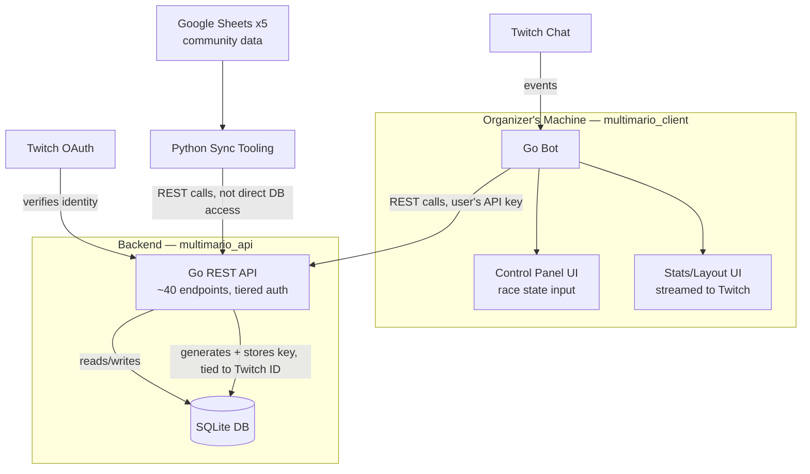
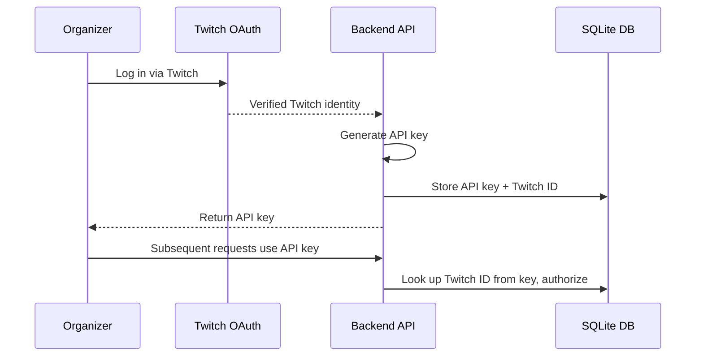

# Multimario API

Backend REST API for the Multimario race bot ecosystem. Handles race state, participant tracking, live broadcast statistics, and admin tooling so client bots don't have to.

Written in Go using the standard library (`net/http`) for routing and request handling. This is the backend counterpart to [multimario_client](https://github.com/ClairRC/multimario_client), the bot organizers run locally to interact with it.

## Table of Contents

-   [Architecture](#architecture)
-   [Auth Flow](#auth-flow)
-   [Features](#features)
-   [Setup](#setup)
-   [API Documentation](#api-documentation)
-   [Design Notes](#design-notes)
-   [Known Issues And TODO](#known-issues-and-todo)

## Architecture



The Python sync tooling deliberately goes through the same API as every other client rather than writing to the database directly, so all writes pass through the same validation and auth checks regardless of source.

## Auth Flow



Every API key is stored alongside the Twitch ID it was issued to, so any admin action taken through the API can be traced back to the account responsible for it.

## Features

-   ~40 REST endpoints covering race management, participant tracking, admin tools, and live race data
-   Twitch OAuth authentication with role-based authorization restricting admin-only functionality
-   Input validation and sanitization across all endpoints, with structured error responses and correct HTTP status codes for malformed or invalid requests
-   Python tooling to sync community-maintained race data from 5 Google Sheets into the backend, entirely through the public API
-   Deployed to DigitalOcean for production use during live community speedrunning events (50+ participants)

## Setup

```bash
git clone https://github.com/ClairRC/multimario_api
cd multimario_api
go run main.go

```

Requires a `settings.json` (see `settings_template.json`) with:

```json
{
    "twitch_client_id": "Twitch client ID",
    "twitch_client_secret": "Twitch client secret",
    "database_path": "path to SQLite database",
    "port": "port the server runs on" 
}
```
**Note:** `port` must include the leading colon (e.g. `:3000`), since it's passed directly to Go's `http.ListenAndServe`.

## API Documentation

Full OpenAPI documentation is currently in progress. This section will be updated with a link to the spec (and a hosted Swagger UI, if applicable) once it's ready. In the meantime, the endpoint definitions are readable directly in `internal/`.

## Design Notes

Auth is split into tiers so that read-heavy endpoints (used for public stats display) stay open, while state-changing endpoints require a valid API key mapped to a sufficiently privileged Twitch account. This keeps race data publicly viewable for broadcast purposes without exposing write access.

## Known Issues and TODO
* GET /players matches twitch_name AND player_name, when it should match twitch_name OR player_name.
* Google Sheets is used as the source of truth for race signups, date, and participant information. This dependency should ideally be flipped in the future so that this database is the main source of truth and the Google Sheets reflects the information within it.
